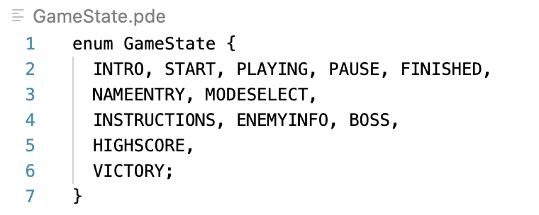

## Our video

## Table of Contents

1. [Our Team](#1-our-team)
    - [Team Members](#team-members)
    - [Team Roles](#team-roles)
2. [Introduction](#2-introduction)
   - [How to Play](#how-to-play)
3. [Requirements](#3-requirements)
   - [Stakeholders](#stakeholders)
   - [Use Case diagram](#use-case-diagram)
   - [User Stories](#user-stories)
   - [Early Stages Design and Ideation process](#early-stages-design-and-ideation-process)
   - [Decision-Making Process](#decision-making-process)
4. [Design](#3-design)
   - [System Architecture](#system architecture)
   - [Class Diagram](#class-diagram)
   - [Communication Diagram](#communication-diagram)
5. [Implementation](#4-implementation)
   - [Multiplayer Mode](#multiplayer-mode)
   - [Leaderboard functionality](#leaderboard-functionality)
   - [UI Integration](#ui-integration)
6. [Evaluation](#5-evaluation)
    - [Qualitative Evaluation](#qualitative-evaluation)
    - [Quantitative Evaluation](#quantitative-evaluation)
    - [Code Testing](#code-testing)
7. [Process](#6-process)
   - [Collaboration](#collaboration)
   - [Tools and Techniques](#tools-and-techniques)
9. [Conclusion](#7-conclusion)
   - [Individual Contributions](#individual-contributions) 

(add sub contents)

# 1. Our Team

## Team members

|         Name         |           Email            | Git Hub Username |
| :------------------: | :------------------------: | :--------------: |
|    Hannah Abedin     |   go20247@bristol.ac.uk    |   hannahabedin   |
|      Sudan Tang      |   yn23171@bristol.ac.uk    |    Sudan0905     |
|      Shunyi Huo      |   fv23962@bristol.ac.uk    | TheWalkingNerd1  |
|   Ouyang Mengmeng    |   ii23098@bristol.ac.uk    |   mimiko134340   |
|      Antai Sun       |   mo23147@bristol.ac.uk    |    sat2357817    |
| Bou Man Jennifer Lau | bmj.lau.2023@bristol.ac.uk |     codeblau     |

## Team Photo

### Team Roles

| Name    | Role                                                                                                                                                                    |
|---------|-------------------------------------------------------------------------------------------------------------------------------------------------------------------------|
| Hannah  | Developer: Tasked with the strategic planning and coding of the game's special features. Implemented spawning mechanism for enemies, distinguishing between simple and complex modes. Enabled multiplayer functionality. |
| Jennifer| UI/UX Designer: Focused on designing the user interface and experience. Responsible for the layout and implementation of the main menu. Wrote help documentation for new players. |
| Mengmeng and Sudan | Artists: Responsible for artistic rendering of characters, enemies, and game backgrounds. Managed integration of background music and sound effects. |
| Shunyi  | Lead Developer: Led the development of the game's main logic and wrote core code for gameplay. Conducted code reviews to maintain quality and consistency. |
| Antai   | Developer: Implemented the leaderboard feature, allowing players to track scores and compete against others. |

## 2. Introduction:

Our game is a shoot-’em-up game inspired by Space Invaders, offering both single and multiplayer modes. Space Swarm Shooters is a modern day version, with unique features to diversify our game. We’ve introduced diverse enemy types, each with its own distinct behaviour and attack strategies. This adds an extra challenge to the game by adding a layer of unpredictability to our game. To survive, players need to move strategically, aim precisely and eliminate enemies before they launch their attacks. Each enemy takedown contributes to the players’ score, as well as the opportunity for power-ups including bullet upgrades. As the game continues, the game intensity increases with a climatic attack from the boss enemy. Only when the boss is destroyed will players win against the enemies. 

## How to play!

**Libraries**
To play our game, you need to install the ddf/Minim library (an audio library)

**Controls**

**Enemies (beware!)**

(insert gifs!!)

Jellyjellies
>Attack type: Jelly shots

Octotos
>Attack type: Glitter Bomb-bardment

Huggooctopuses
>Attack type: Free hugs :)

Laser crabs:
>Attack type: PDA that burns

Astrachniss
>Attack type: Sniper no sniping

The boss:
>Attack type: Play to find out..

How to win: beat the enemies to land a victory

## 3. Requirements
Requirements help to clearly define software projects and meet the expectations of the end-users and stakeholders. 

### Stakeholders

We used the onion model to systematically identify our stakeholders across the different group layers. Our game is the core of the onion model, as the product that we are developing. Moving outwards to the system layer, we recognised ourselves as the normal operators developing the game’s core functionality. We also recognised students and university lecturers as stakeholders acting as game-testers and sources of feedback. Expanding further to the containing system, we acknowledged the users of our game, including students, friends and family and social gamers. The UI art team are also key stakeholders in this system, involved in maintaining the interface of the game. Finally, in the wider environment, we considered the influence our game could have on existing shoot ‘em games, recognising our effect as a negative stakeholder by creating a competitor-game. In contrast, we also included those who may play and enjoy the game, as well as those who could provide networking opportunities the expand the game further, for example a university gaming society. 

### Use case diagram

The use case diagram was crucial in identifying interactions between actors and system components in our game. Visualising use cases helped us understand the game's functionality and flow, clarifying requirements and prioritising features. It also facilitated planning for multiplayer functionality by illustrating player interactions.

### User Stories
#### Player roles:

##### Scenario 1: Navigate with Ease

>*As a player, I want a straightforward and easy-to-understand interface so that I can quickly get started without spending time learning complex operations. This will allow me to focus*

##### Scenario 2: Master of Modes

>*As a player, I want to be able to choose between different game modes such as campaign, endless, and speed modes. This flexibility allows me to tailor the game experience to my preferences and skill level, enhancing engagement and satisfaction.*

##### Scenario 3: Embrace the Challenge

>*As a player, I expect the game to offer a variety of challenges, including dynamic environments and unpredictable enemy behaviors, which increase the game's depth and replay value.*

#### Developer Roles:

##### Scenario 1: Interface Optimisation
> *As a Frontend Developer, I aim to create a user-friendly interface, ensuring players can dive into the game without any hassle.*

##### Scenario 2: Mode Implementation
> *As a Backend Developer, my goal is to implement various game modes, providing players with diverse gameplay options tailored to their preferences.*

##### Scenario 3: Challenge Design
> *As a Game Designer, I'm focused on crafting engaging challenges, from dynamic environments to cunning enemy behaviors, enhancing the game's depth and replayability.*

### Use case reflection

Creating several use case specifications allowed the group to break down the game into its different components, enabling us to explore key detaisl of the game. The key use case specifications for our game include: level design, optimisation, unique features and user interface. Each specification focused on specific elements of the game and helped us refine each part. For example, in the level design we decided on 2 main levels that the player can choose from - endless mode and speed mode. Furthermore, it allowed us to think about how each element of the game will integrate with each other. For example, a unique feature is enemy-spawning aliens, which needed to be adapted to fit each game mode. This process gave us a high level understanding of the game, which will aid us when planning the game.

### Early Design Stages and Ideation Process
At the early stage of our game concept development, our team conducted thorough research and preliminary surveys to identify the target audience and their specific needs. These included a demand for games that are easy to learn, a fast-paced and an addictive game. To ensure our game design was appealing, we organised multiple brainstorming sessions. These meetings not only facilitated the exchange of creative ideas but also allowed us to draw from successful elements of similar games on the market. 

**create a mindmap for the brainstorming**

During this process, we emphasised the need for a user-friendly interface paired with a comprehensive and easy-to-understand game guide, enabling new players to quickly grasp and enjoy the game. We also decided to offer a variety of game modes and levels, such as the option to play in solo or duo modes, which enhances the game's social interactions and broadens its audience appeal. In terms of level design, players can choose between easy or difficult modes based on their gaming skills, ensuring the game remains engaging over time and continues to attract players. We placed particular importance on innovative game mechanics, such as a dynamic enemy generation system. This ensures each game session remains fresh and challenging. By addressing these needs, our goal is to create an enjoyable gaming experience that meets player expectations.

Paper prototyping also helped us create an initial design plan for our game. This was particularly helpful during discussions about the game’s architecture and class design, which helped us plan our class structure.

**(add paper prototyping video)**

### Decision-Making Process

Our team made decisions through open discussions and voting until a general consensus was made among team members. Initially, when choosing the theme and style of the game, each member presented different views based on their interests—for example, some preferred casual game styles, while others favoured combat-oriented games. Through group discussions, we assessed the potential advantages and risks of each option and ultimately selected the theme that best matched our collective interests. This led to the development of our current aircraft battle game. During the game feature brainstorming stage, we also went through a decision-making discussion where each member listed potential game features they wanted to implement. Considering creativity and technical feasibility, we decided to focus on the dynamic enemy generation as our main features.

## 4. Design

### System architecture
The system architecture of our game comprises several parts, including game state management, user interface, enemy type and game elements. Each part contributes to the overall functionality and experience of the game.

**Game State Management**

The core design of the game architecture is the Game State Management system, encapsulated within the ``GameState`` enum. 

This enum controls the gameplay flow by managing state transitions, responding to user input and coordinating interactions between various game elements. Event handler methods translate keyboard and mouse events into actions within the game. In single-player mode, players navigate using the arrow keys and utilise the spacebar for shooting actions, providing an intuitive and straightforward control scheme. For two-player mode, we opted for the ``WASD`` keys for movement and the ``F`` key for shooting, ensuring a comfortable and balanced gameplay experience for both players. By using the GameState enum and responsive event handling mechanisms, the game architecture maintains coherence, resulting in a fulfilling gaming experience.

**User Interface (UI)**

The User Interface (UI) component plays an important role in providing players with visual feedback and interactive elements for a user-friendly experience. Through start screens and menus, the UI offers players different options to either begin or resume gameplay, adjust settings, access instructions and view highscores via a leaderboard. We aimed for a clear but effective design to ensure ease of use. 

**Enemy Diversity**

The UI also highlights the diversity among each enemy, each having unique attacking behaviours, represented visually to the player. Alongside this, each enemy has a distinctive appearance and behaviour. The corresponding enemy bullets also have various shapes to indicate different attack players, allowing players to anticipate and respond strategically. This adds a level of originality, variability and interest to the game and helps maintain user engagement. 

**Game elements**

In our game, various elements contribute to gameplay, including players, enemies, and their respective bullet types. Each element is represented by a separate class, with distinct attributes that introduce challenge and strategy. This modular class design promotes a well-structured codebase, facilitating maintenance and enabling future expansion.

To ensure optimal performance, we utilise efficient data structures for storing game entities. Additionally, we implement design patterns like object pooling to minimise memory allocation and enhance game efficiency, particularly in scenarios involving high volumes of bullets or enemies on the screen. These optimisations result in a smooth gameplay experience and contribute to an enjoyable game overall enriched by immersive sound effects. 

#### Class diagram

As our game development progressed, we refined and expanded our class diagram to reflect the evolving structure and the functionality of the game. The updated class diagram shows the inheritance hierarchy among the different game entities, such as the players and enemies, and their associated bullets. The updated class diagram brings a new level of structure to our design plan, providing a more cohesive architecture. While still aligning with our initial concept, the revised diagram has a more intuitive way for the enemies and players to interact. This helped with planning and implementing the collision-detection mechanism. 

### Communication Diagram

We created a communication diagram for a clear visual representation of how the different classes interacted with each other. This diagram allowed us to understand the flow of communication between objects and classes in our game. This also helped to ensure that player’s interactions with enemies and the game environment were handled properly, by mapping out methods such as ``shootBullets()`` and ``isHit()``. 

The extensive planning and object–oriented design was a major factor in the smooth operation of the game, the interoperability and usability of code, and the ease with which each team member could contribute to development in an agile-way, able to implement features and classes that independently and cohesively interact with each other.

## 5. Implementation

Areas of challenge:
1. Multiplayer mode
2. Leaderboard functionality
3. UI Integration

## Multiplayer mode

We wanted to incorporate a co-operative 2 player mode into our game in addition to the single player version. We explored two ways to do this: online or local (offline on the same PC). During research, we discovered that working with the networks needed to implement online multiplayer would be difficult, especially considering we have no prior experience working with networks. Our game relies heavily on the use of a large number of multiple entities on the screen and collision detection between them. Due to latency issues when using online multiplayer networks, it was likely our game would encounter bugs when trying to track all the object locations and interactions correctly in real-time for both players. Taking into account the development time allocated for the project, and our experience level, we felt more confident implementing the local multiplayer approach. 

Having 2 people playing on the same computer brought a different set of challenges, such as accurate multiple keypress detection, so inputs and interactions would be linked to the correct player and multiple inputs would not clash with each other and cancel each other out. 

There were other challenges when implementing a multiplayer mode. Challenges included supporting name input for both players, simultaneous score tracking for two players, and then post-game display of the winner/loser, and if high scores were achieved. To achieve this, we needed to ensure careful tracking of various variables, flexible code and dynamic data structures. 

Through dynamic code design and a flexible, agile approach, we were able to add local multiplayer functionality to our game. 

**(add pictures of 1 player vs 2 player)**

### Leaderboard functionality

We wanted to implement a scoreboard similar to retro arcade games, which displays names and scores of top players. Thus we needed a dynamic data structure to store game information to ensure data persists between games. This required the design of various game pages:  name input, victory page and game-over pages alongside the scoreboard page, which would retrieve the stored data to display it to the user. 

We used the “ArrayList” data structure to store scores because it supports dynamic data management. Each score is encapsulated within a “ScoreEntry” object, which includes the player’s name and score. When a new score is high enough to merit inclusion, it is added and the entire list is then sorted in descending order. To maintain the leaderboard’s size, we remove the lowest score.

Given the need for data persistence, we use a text file named “highscores.txt” to store leaderboard data. This ensures scores are loaded each time the game starts and saved whenever the leaderboard updates. During implementation, we encountered several challenges. Firstly, there were performance concerns, especially with a large number of players, as sorting after each new score could impact performance. To address this, we only sort when necessary and reduce processing time by limiting the leaderboard's size. Another challenge was preventing data loss, particularly in cases where scores weren’t saved if the game unexpectedly closed. To tackle this issue, we implemented automatic saving, ensuring data is saved regularly.

Through these measures, we successfully overcame the challenges of implementing the leaderboard functionality and significantly enhanced interactivity and player engagement. 

**(add gif of leaderboard)**

### UI Intergation

**(add gif of instruction page)
(gif of paused page)**

We used UI storyboards to ensure development was guided with users in mind. Applying the agile ethos, we adapted our storyboards sprint by sprint and ensured each new feature was developed with UI in mind. For example, when implementing the leaderboard, we ensured scores were displayed in a large font - alongside the player’s name - in a visually appealing, recognizable way. 

Through the design process, we studied Nielson’s 10 heuristic principles and sought to apply them. These principles enhance usability and create a user-friendly experience. For example, we used standardised controls to adhere to the principle of “Recognition not recall” and we created an instruction manual for “help and documentation”. 

Through user-testing, users often couldn’t tell they’d received power ups. We wished to illustrate this but it was challenging to make this clear without having a distracting effect on gameplay or performance. To solve this we show shooting level upgrades by changing the aircraft's icon. This keeps players informed about their current shooting level status simply and effectively.

When implementing a multiplayer mode, we found the UI could be unclear as to whose lives belong to which player as player hearts could overlap. To overcome this, we created a multilayer health visualisation, limiting the hearts display for each player to half the screen and changing the colour of the hearts to indicate more lives when each layer is “full”. 

We were able to cleverly solve complex situations and adhere to industry-standard heuristic principles. This was consistently implemented and thoroughly tested through heuristic evaluation, contributing to user-driven development. 

## 6. Evaluation

### Qualitative Evaluations

**Think Aloud Evaluation: 11/03/2024**

In our evaluation, we utilised a think aloud approach, where participants vocalised their thoughts while engaging with the game. We generated a word cloud from the think aloud data. This visual representation highlights recurring themes and key phrases, providing a quick and accessible overview of the user experience.

### Feedback 1
#### Positives:
1. The game design is engaging.
2. Background music adds suspense.

#### Improvements:
1. Can’t shoot and move the player at the same time.
2. The controls for the player and shooting are unclear.
3. The default game mode was too challenging with too many enemies appearing at once.

### Feedback 2:
#### Positives:
1. The objective of the game is clear.
2. The different types of enemies make the game more interesting to play, especially the enemy that follows you.

#### Improvements:
1. Multiplayer would make the game more enjoyable.
2. You don’t always lose a life when the enemy hits the player.

**Heuristic Evaluation: 11/03/24**

| Interface               | Issue                                                                                                                                     | Heuristic             | Frequency | Impact | Persistence | Severity |
|-------------------------|-------------------------------------------------------------------------------------------------------------------------------------------|-----------------------|-----------|--------|-------------|----------|
| Player-Enemy Interaction | Inconsistent consequence of player-enemy contact. This meant that even though the player hit an enemy, the player would not always lose a life. This meant that the player was unsure if the enemy itself was deadly or just the bullets. | Error Prevention     | 4         | 4      | 3           | 3.7      |
| Movement Controls       | Lack of labels for shooting, which meant players would often die quickly when they first played the game as they were unsure which key controlled shooting to kill the enemies.                           | Help and Documentation | 3         | 4      | 2           | 3.0        |
| Visual Feedback         | Absence of visual cues to indicate successful hits on enemies. This meant that players were unsure if they successfully hit the enemies and impacted playing morale.                                   | Visibility of system status | 4         | 1      | 3           | 2.7     |
| Game Progression        | Unclear progression indicators, such as levels completed or any score milestones.                                                        | Visibility of System Status | 2         | 2      | 3           | 2.3      |
| Level Design            | Lack of environmental variety, making the game feel repetitive over time.                                                                | Consistency and Standards | 3         | 2      | 3           | 2.7     |

### Quantitative Evaluation

**System Usability Scale (SUS) Analysis: 16/4/24**

We conducted a focus group test with 10 participants to assess the System Usability Scale (SUS) of the game. Our findings from this numerical test demonstrated that users found the game easy to play, with minimal need for prior knowledge or technical support. A majority strongly agreed that they would use the product frequently and felt confident to use it effectively. The scores from all participants were generally consistent, indicating a cohesive response across the group. While there were no outliers, participants expressed slightly less confidence in the game’s consistency. This feedback informed our decision to refactor the code and refine gameplay to enhance consistency. Despite this point of improvement, the overall positive feedback encouraged our approach.

#### Easy Mode

| Question                                                                   | P1 | P2 | P3 | P4 | P5 | P6 | P7 | P8 | P9 | P10 | Mean |
|----------------------------------------------------------------------------|----|----|----|----|----|----|----|----|----|-----|------|
| I think that I would like to use this system frequently                  | 5  | 4  | 5  | 3  | 5  | 4  | 4  | 3  | 4  | 4    | 4.2  |
| I found the system unnecessarily complex                                  | 1  | 2  | 2  | 4  | 1  | 1  | 2  | 2  | 1  | 1    | 1.7  |
| I thought the system was easy to use                                       | 5  | 4  | 4  | 4  | 5  | 4  | 4  | 5  | 3  | 3    | 4.1  |
| I think that I would need the support of a technical person to be able to use this system | 1            | 1  | 1  | 1  | 1  | 1  | 1  | 1  | 1  | 1  | 1.0  |
| I found the various functions in this system were well-integrated         | 4  | 4  | 3  | 2  | 4  | 4  | 3  | 5  | 4  | 4    | 3.7  |
| I thought there was too much inconsistency in this system                  | 1  | 3  | 2  | 3  | 1  | 2  | 1  | 2  | 1  | 2    | 1.8  |
| I would imagine that most people would learn to use this system very quickly | 5  | 5  | 5  | 5  | 1  | 5  | 5  | 4  | 3  | 5    | 4.3  |
| I found the system very cumbersome to use                                  | 1  | 1  | 2  | 1  | 1  | 2  | 2  | 2  | 3  | 1    | 1.6  |
| I felt very confident using the system.                                    | 5  | 3  | 3  | 2  | 5  | 5  | 3  | 5  | 3  | 4    | 3.8  |
| I needed to learn things before I could get going with this system.        | 1  | 1  | 1  | 2  | 1  | 1  | 1  | 1  | 2  | 2    | 1.3  |

#### Hard Mode
| Question                                                                   | P1 | P2 | P3 | P4 | P5 | P6 | P7 | P8 | P9 | P10 | Mean |
|----------------------------------------------------------------------------|----|----|----|----|----|----|----|----|----|-----|------|
| I think that I would like to use this system frequently                    | 4  | 4  | 4  | 4  | 4  | 5  | 4  | 5  | 3  | 4   | 4.1  |
| I found the system unnecessarily complex                                  | 1  | 1  | 1  | 1  | 1  | 1  | 1  | 1  | 1  | 1   | 1.0  |
| I thought the system was easy to use                                      | 2  | 3  | 3  | 3  | 4  | 4  | 4  | 3  | 5  | 4   | 3.5  |
| I think that I would need the support of a technical person to be able to use this system | 2            | 1  | 1  | 1  | 1  | 1  | 1  | 1  | 1  | 1  | 1.1  |
| I found the various functions in this system were well-integrated         | 4  | 3  | 4  | 2  | 5  | 4  | 4  | 4  | 5  | 5   | 4.0  |
| I thought there was too much inconsistency in this system                 | 1  | 2  | 3  | 3  | 1  | 1  | 2  | 1  | 2  | 1   | 1.7  |
| I would imagine that most people would learn to use this system very quickly | 3  | 4  | 3  | 4  | 4  | 5  | 5  | 5  | 4  | 4   | 4.1  |
| I found the system very cumbersome to use                                 | 3  | 2  | 3  | 2  | 2  | 2  | 2  | 2  | 2  | 2   | 2.2  |
| I felt very confident using the system.                                   | 3  | 4  | 5  | 5  | 5  | 5  | 5  | 5  | 5  | 4   | 4.6  |
| I needed to learn things before I could get going with this system.        | 2  | 2  | 3  | 2  | 2  | 2  | 1  | 2  | 1  | 1   | 1.8  |

### Wilcoxen Signed Rank Test
1. Replace the data pairs with their difference

| Participant | Easy Mode (EM) | Hard Mode (HM) | Difference (EM - HM) |
|-------------|----------------|----------------|----------------------|
| P1          | 4.2            | 4.1            | 0.1                  |
| P2          | 1.7            | 1.0            | 0.7                  |
| P3          | 4.1            | 3.5            | 0.6                  |
| P4          | 1.0            | 1.1            | -0.1                 |
| P5          | 3.7            | 4.0            | -0.3                 |
| P6          | 1.8            | 1.7            | 0.1                  |
| P7          | 4.3            | 4.1            | 0.2                  |
| P8          | 1.6            | 2.2            | -0.6                 |
| P9          | 3.8            | 4.6            | -0.8                 |
| P10         | 1.3            | 1.8            | -0.5                 |

2. Rank the differences

| Difference | Rank | Signed Rank |
|------------|------|-------------|
| 0.1        | 1    | 1           |
| 0.1        | 2    | 2           |
| -0.1       | 3    | -3          |
| 0.2        | 4    | 4           |
| -0.3       | 5    | -5          |
| -0.5       | 6    | -6          |
| -0.6       | 7    | -7          |
| 0.6        | 8    | 8           |
| -0.7       | 9    | -9          |
| -0.8       | 10   | -10         |

Positive rank sum = 25

Negative rank sum = 30

W test Statistic = 25
- 25 is greater than 8 
- This means there is a statistical significance when using a p value of 0.05
- This shows that the rise in difficulty between the ‘hard’ mode and the ‘easy’ mode in our game is statistically significant

In our analysis of the System Usability Scale (SUS) scores for both the Easy Mode (EM) and Hard Mode (HM) of the game, we observed a notable difference between the two difficulty levels. Conducting a Wilcoxon signed-rank test revealed a significant distinction in participants' responses.

Specifically, when comparing the mean scores for the statement "I thought the system was easy to use," we observed a clear contrast between the Easy and Hard modes. In the Easy Mode, participants rated the system's ease of use with a mean score of 4.1, indicating a generally favourable perception of usability. However, in the Hard Mode, this score decreased to 3.5, suggesting that participants found the system comparatively less user-friendly when faced with increased complexity or difficulty.

This discrepancy showed the impact of system complexity on users' perceptions of ease of use. It indicates that as the difficulty level of the game increased, participants were more likely to perceive the system as less intuitive or straightforward to navigate.
This finding has significant implications for the design and development of the game, highlighting the importance of balancing complexity with user-friendliness to ensure optimal usability across different skill levels. By refining the gameplay and addressing areas of complexity identified in the Hard Mode, we can strive to enhance overall user experience and satisfaction.

### Code Testing
We used a combination of different testing methods to thoroughly test our code, including Unit testing, Integration testing and Manual testing. Unit testing focused on isolating individual code components to ensure that it produced the expected behaviour. For example, we tested the enemy behaviours and player interactions to ensure robustness and reliability. 

This is shown in the ``EnemyTest`` class, which tests collision detection and interactions with player entities through the ``testIsHit()`` method. This validated critical functionalities in the code, including enemy detection of the player bullets and the subsequent damage to the enemy.

Integration testing focused on evaluating how the different game components interacted and functioned together as one system. This involved writing test cases for various scenarios to assess the integration of components.

In addition to automated testing, manual testing played a role in validating the game functionality and user experience. This involved hand-on testing of the game across different operating systems, which helped to identify bugs or usability issues that automated tests may have missed. This helped to improve the overall performance and quality of our game. 

## 7. Process

### Collaboration

Throughout this project, we applied various methods to ensure smooth teamwork. After each Monday lab, we had a meeting to discuss the tasks given for that week and divided them equally based on their estimated story points. This approach ensured that each person had a fair and balanced workload, as well as checking that each task was achievable within the week. To check our progress, we had a follow-up meeting towards the end of the week. This involved each team member discussing their work and was an opportunity to ask any questions to the group. At the end of each major phase of the project, we organised review meetings, which not only helped us summarise experiences but also identified areas for improvement.

We used Teams as our main communication platform, which allowed us to maintain real-time communication in remote or hybrid setup. The features in Microsoft Teams, like video calls, team chat, and file sharing, really stepped up our teamwork. This made it easier to collaborate efficiently, ensuring that information flowed smoothly without any interruptions.

At the start of the project, we made sure that every team member was clear about their role and specific responsibilities. This measure reduced redundant work and misunderstandings, with each role being assigned clear expectations, from project managers to technical experts, each person held accountable for the project's success.

Together, these roles facilitated a well-rounded development process, each team member's expertise contributing uniquely to the project's success, resulting in a comprehensive and engaging game experience for users.

### Tools and Techniques

We chose Jira as our project management tool to create a Kanban board, which supports agile development workflows, allowing us to effectively plan, track, and release software development projects. A successful Kanban board focuses on continuous improvements (referred to as kaizen) [1]. 

We recognised the limitations of using a Kanban board to track progress, for example the length of a task is not always estimated appropriately [2]. To overcome this, we set up regular team meetings, including weekly progress updates and strategy discussions as needed. These meetings not only allowed us to monitor project progress in real time but also provided a platform for everyone to express opinions and raise issues, ensuring transparency in decision-making and synchronisation within the team.

Together, these roles facilitated a well-rounded development process, each team member's expertise contributing uniquely to the project's success, resulting in a comprehensive and engaging game experience for users.

### Tools and Techniques

We chose Jira as our project management tool to create a Kanban board, which supports agile development workflows, allowing us to effectively plan, track, and release software development projects. A successful Kanban board focuses on continuous improvements (referred to as kaizen) [1]. 

We recognised the limitations of using a Kanban board to track progress, for example the length of a task is not always estimated appropriately [2]. To overcome this, we set up regular team meetings, including weekly progress updates and strategy discussions as needed. These meetings not only allowed us to monitor project progress in real time but also provided a platform for everyone to express opinions and raise issues, ensuring transparency in decision-making and synchronisation within the team.

**(add sprint screenshot and team meetings)**

In addition to the Kanban board, we used emails to share Meeting Minutes, helping document and monitor the work we had done each week. These included a helpful summary of the meetings to make sure that everyone understood the points discussed and clarified the future work we needed to complete. 

**(add meeting images)**

When it came to implementing game features, as Shunyi has experience working as a software engineer, he suggested we use pair programming. For example, during the implementation of multiplayer, Antai was the help whilst Shunyi was the tactician. Using this technique helped us all learn and benefit from Shuny’s prior knowledge whilst also helping to improve our code quality. 

During the easter holidays, we divided up tasks ready to complete our sprints. However, a few team members were ill over the holidays, which delayed our progress. This led to some heroic efforts in the last week of break. To compensate we re-evaluated our tasks during a meeting and completed a second sprint where we managed to complete the implementation of all additional features.

**(add burn charts)**

By having additional meetings where necessary, it helped us to progress quickly as a team to complete all necessary tasks. This allowed clear communication and contributed to a well-understood workflow and minimised impact of individual disruptions to the team, as each member was familiar with the other’s work, reducing the impact of a developer being sick, on holiday, or facing unseen circumstances.  

Another technique we used in line with the agile ethos was continuous integration. We ensured the game was built iteratively, with features built on top of one another, but simultaneously implemented a rule where code was automatically built and tested every time a change was made. Before merging, code pairs were required to show evidence of testing and building. This helped ensure new code integrated smoothly with the existing code base, reducing the likelihood of bugs and errors.

Where a programming pair was struggling with ironing out bugs or fixing an integration problem, they could quickly flag using our messaging channels which allowed other developers to help, increasing the speed of developer feedback loops. By only committing and merging code that was operational, various teams could work simultaneously, and this ensured no single team was hindered by the short-term struggles of another team. Thus, continuous integration was a key asset of our agile and test-driven development approach. 

## 8. Conclusion

### Individual Contributions

Hannah: 1.00

Jennifer: 1.00

Mengmeng: 1.00

Sudan: 1.00

Shunyi: 1.00

Antai: 1.00

Building space swarm shooters was an incredible opportunity to showcase the skills we learnt during this course. Throughout the project, we used concepts outlined in lectures, including software design, testing and documentation. 

Our project’s success is centred on a well-structured development process, which adequately utilised the skillsets of every member. We divided up tasks ensuring every team member contributed to software development. We were able to master the use of Processing, using it to carry out development in an agile way, iteratively building features and testing them using the principles of continuous integration. 

Central to the success of this collaborative effort was that every team member adequately understood the ideas behind the game and its twist and the requirements we were working towards. From generating ideas and paper prototyping to the final submission, all decisions and choices were made collaboratively, and we believe this team-centred approach was crucial to success. 

We utilised our team’s expertise from prior experience to correctly implement agile project management workflow, task control, and team monitoring. While individual accountability was crucial, the collaborative approach during feature implementation ensured team member’s were able to assist with certain difficult features. The well-designed code structure, with class diagrams, communication diagrams and object-oriented design facilitates fast and efficient development. 

As we developed our game, the principles of continuous integration, rigorous testing, and HCI evaluation were crucial. We wanted our game’s development to be truly test-driven, so we ensured quantitative and qualitative evaluations occurred. Think aloud and heuristic evaluations were integrated alongside the NASA TLX and the System Usability Scale. Simultaneously, the software and code was rigorously tested and refactored, to ensure optimal object-oriented design, time and space-efficient algorithms and data structures. This contributed to limiting bugs, errors and ensuring smooth and reliable game operation. 

We encountered and overcame many challenges, such as refining collision detection, implementing multiplayer functionality and coordinating remote work during the holidays. These hurdles reinforced the importance of effective communication and teamwork. The technical challenges also required collaborative debugging sessions. Understanding each other’s coding styles also proved challenging at times, however this process resulted in a deeper understanding of a code and the sharing of knowledge within the team. Moving forward, this experience will serve as a founding for future coding group projects.

Looking ahead, we plan on refining gameplay, and integrating new features such as additional power-ups and clearer levels. Optimising performance is still a priority to ensure the game remains robust. These new features and performance optimisation will go hand-in-hand with new software engineering skills we seek to develop. Having worked together, we believe the team is ideally placed to carry out the next phases of development. 

In conclusion, our project journey has not only strengthened our technical skills, but it has also provided valuable insights into the software engineering process, including agile methods, requirements planning and evaluation techniques, which will undoubtedly be beneficial in future projects. 

