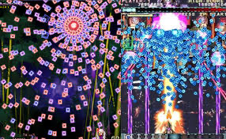
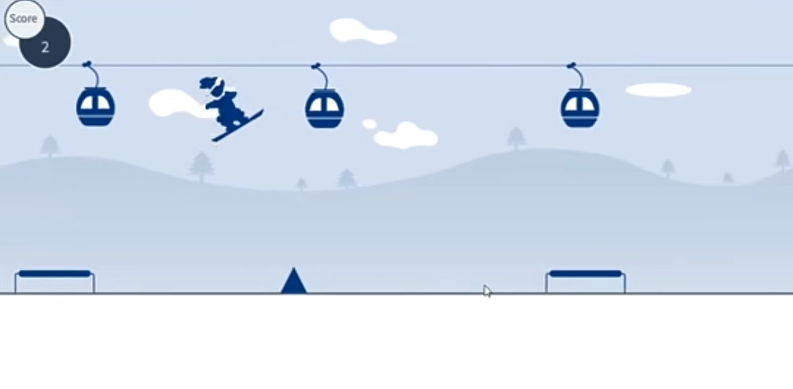

# Game idea1: vertical-scrolling shooter game 

 

## 1.Discription

Vertical-scrolling shooter game is a very classic gaming type. For this idea, the game should be designed based on the general concept of this type but has some unique features. First, the shooting object will be controlled by keyboard, the enemies will appear dynamically along with others statically setup on the map. The map can be various landscapes for each level.  

There will be some general features like fire system upgrading, bonus points earned by coins from the destroyed enemies, and more details will be discussed in Monday’s session. 

## 2.Challenge

1.Accurate collision detection range for all the objects and distinguishing the difference of bullets and coins. 

2.Two operators would be good, but obviously challenging 

3.Resurrection from destruction and carry on with the previous fire system. 

# Game idea2:single-player skiing game

## 1.Discription

This is a single-player skiing game where the player's goal is to navigate a skier through a series of obstacles. The player clicks the mouse to raise the skier. Over time, obstacles will appear at varying intervals, and players must precisely control the skier's jumps to avoid colliding with them. Each successful navigation past an obstacle increases the player's score.

## 2.Challenge

1.Game Physics: Implementing the skier’s jumps and landings may require some knowledge of physics. We need to consider factors such as gravity, speed, and friction to make the game appear realistic.

2.Obstacle Generation: We need to write code to generate obstacles at appropriate times. This may involve the use of random number generation and timers.

3.Collision Detection: We need to be able to detect whether the skier has hit an obstacle. This may require complex geometric calculations, especially if the shapes of our obstacles and skier are complex.

4.User Interface and Experience: We need to design an intuitive and easy-to-use user interface so that players can easily start the game, view their score, and restart. We also need to consider how to provide feedback to players so they know whether they have successfully navigated past an obstacle or if they have hit an obstacle.